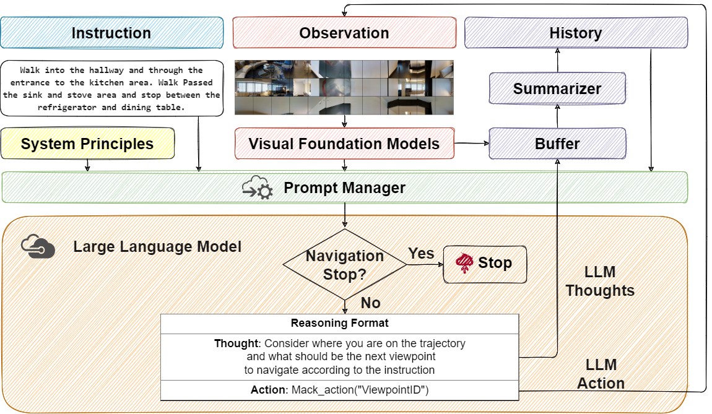

<div align="center">

<h1>🎇NavGPT: Explicit Reasoning in Vision-and-Language Navigation with Large Language Models</h1>

<div>
    <a href='https://github.com/GengzeZhou' target='_blank'>Gengze Zhou<sup>🍕</sup></a>;
    <a href='http://www.yiconghong.me' target='_blank'>Yicong Hong<sup>🌭</sup></a>;
    <a href='http://www.qi-wu.me' target='_blank'>Qi Wu<sup>🍕</sup></a>
</div>
<sup>🍕</sup>Australian Institude for Machine Learning, The University of Adelaide <sup>🌭</sup>The Australian National University

<br>

<div>
    <a href='https://github.com/GengzeZhou/NavGPT' target='_blank'></a>
    <a href='https://arxiv.org/abs/2305.16986' target='_blank'></a>
    <a href="https://opensource.org/licenses/MIT"></a>
    <a href="https://github.com/langchain-ai/langchain"></a>
</div>

</div>


## 🍹 Abstract
 Trained with an unprecedented scale of data, large language models (LLMs) like ChatGPT and GPT-4 exhibit the emergence of significant reasoning abilities from model scaling. Such a trend underscored the potential of training LLMs with unlimited language data, advancing the development of a universal embodied agent. 
 In this work, we introduce the NavGPT, a purely LLM-based instruction-following navigation agent, to reveal the reasoning capability of GPT models in complex embodied scenes by performing zero-shot sequential action prediction for vision-and-language navigation (VLN).
 At each step, NavGPT takes the textual descriptions of visual observations, navigation history, and future explorable directions as inputs to reason the agent's current status, and makes the decision to approach the target.
 Through comprehensive experiments, we demonstrate NavGPT can explicitly perform high-level planning for navigation, including decomposing instruction into sub-goal, integrating commonsense knowledge relevant to navigation task resolution, identifying landmarks from observed scenes, tracking navigation progress, and adapting to exceptions with plan adjustment. 
 Furthermore, we show that LLMs is capable of generating high-quality navigational instructions from observations and actions along a path, as well as drawing accurate top-down metric trajectory given the agent's navigation history. Despite the performance of using NavGPT to zero-shot R2R tasks still falling short of trained models, we suggest adapting multi-modality inputs for LLMs to use as visual navigation agents and applying the explicit reasoning of LLMs to benefit learning-based models.

## 🍸 Method


## 🍻 TODOs

- [x] Release 🎇NavGPT code.
- [x] Data preprocessing code.
- [x] Custuomized LLM inference guidance.

## 🧋 Prerequisites

### 🍭 Installation

Create a conda environment and install all dependencies:

```bash
conda create --name NavGPT python=3.9
conda activate NavGPT
pip install -r requirements.txt
```

### 🍬 Data Preparation

Download R2R data from [Dropbox](https://www.dropbox.com/sh/i8ng3iq5kpa68nu/AAB53bvCFY_ihYx1mkLlOB-ea?dl=1). Put the data in `datasets` directory.

Related data preprocessing code can be found in `nav_src/scripts`.

### 🍫 OpenAi API

Get an [OpenAI API Key](https://platform.openai.com/account/api-keys) and add to your environment variables:

```bash
# prepare your private OpenAI key (for Linux)
export OPENAI_API_KEY={Your_Private_Openai_Key}

# prepare your private OpenAI key (for Windows)
set OPENAI_API_KEY={Your_Private_Openai_Key}
```

Alternatively, you can set the key in your code:
```python
import os
os.environ["OPENAI_API_KEY"] = {Your_Private_Openai_Key}
```

## 🍷 R2R Navigation

### 🍴 Reproduce Validation Results

To replicate the performance reported in our paper, use GPT-4 and run validation with following configuration:
```bash
cd nav_src
python NavGPT.py --llm_model_name gpt-4 \
    --output_dir ../datasets/R2R/exprs/gpt-4-val-unseen \
    --val_env_name R2R_val_unseen_instr
```

Results will be saved in `datasets/R2R/exprs/gpt-4-val-unseen` directory.

The defualt `--llm_model_name` is set as `gpt-3.5-turbo`.

An economic way to try 🎇NavGPT is by using GPT-3.5 and run validation on the first 10 samples with following configuration:
```bash
cd nav_src
python NavGPT.py --llm_model_name gpt-3.5-turbo \
    --output_dir ../datasets/R2R/exprs/gpt-3.5-turbo-test \
    --val_env_name R2R_val_unseen_instr \
    --iters 10
```

### 🥢 Set up Custom LLMs for 🎇NavGPT
Add your own model repo as a submodule under `nav_src/LLMs/`:
```bash
cd nav_src/LLMs
git submodule add {Your_Model_Repo}
```
or just copy your local inference code under `nav_src/LLMs/`.

Follow the [instructions](nav_src/LLMs/Add_Custom_Models.md) to set up your own LLMs for 🎇NavGPT.

Run 🎇NavGPT with your custom LLM:
```bash
cd nav_src
python NavGPT.py --llm_model_name your_custom_llm \
    --output_dir ../datasets/R2R/exprs/your_custom_llm-test
```

## 🧃 Citation
If 🎇`NavGPT` has been beneficial to your research and work, please cite our work using the following format:
```
@article{zhou2023navgpt,
  title={NavGPT: Explicit Reasoning in Vision-and-Language Navigation with Large Language Models},
  author={Zhou, Gengze and Hong, Yicong and Wu, Qi},
  journal={arXiv preprint arXiv:2305.16986},
  year={2023}
}
```
